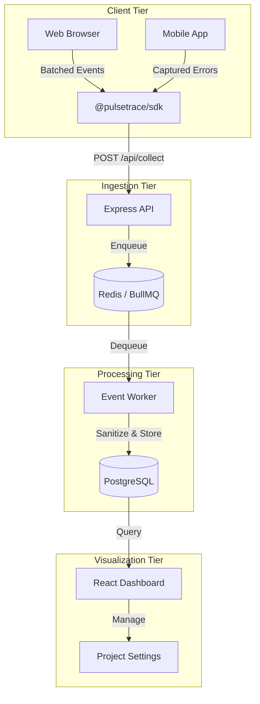

<div align="center">
  <h1>PulseTrace 🚀</h1>
  <p><strong>Open-source, enterprise-grade telemetry and error tracking for the modern web.</strong></p>

  [](https://github.com/KumarDhananjaya/pulsetrace/actions)
  [](https://opensource.org/licenses/MIT)
  [](https://vitejs.dev/)
  [](https://expressjs.com/)
  [](https://api.prisma.io/)
</div>

---

## 🌟 Overview

PulseTrace is a high-performance monitoring platform designed to provide developers with deep insights into application health, performance, and reliability. Built with a focus on developer experience and low-latency data processing, PulseTrace handles everything from real-time event streaming to historical uptime analysis.

### Why PulseTrace?

*   **⚡ High-Throughput Ingestion**: Batched event processing powered by Redis and BullMQ.
*   **📊 Web Vitals Intelligence**: Native support for LCP, INP, and CLS monitoring.
*   **🌐 Global Uptime**: Distributed monitoring checkpoints with 24-hour history visuals.
*   **🔍 Structured Logging**: Powerful log explorer with real-time level filtering.
*   **🛡️ Enterprise Auth**: Secure OAuth integration and project-level session management.

---

## ✨ Features

### 📊 Real-World Performance Monitoring
Track exactly how your users experience your site. PulseTrace captures Core Web Vitals and provides device/browser breakdowns to identify bottlenecks instantly.


### 🌐 Availability & Uptime
Stop guessing. Monitor your endpoints globally and visualize availability trends with our high-fidelity status bars.


### 🩺 Real-time Diagnostics
View incoming events as they happen. Our live feed and structured log explorer make debugging in production a breeze.


---

## 🏗️ Architecture

PulseTrace uses a robust, decoupled architecture to ensure scalability and reliability.



---

## 🚀 Getting Started

### Prerequisites

*   **Node.js** (v18+)
*   **Docker** (for Redis and PostgreSQL)
*   **npm** (v10+)

### 1. Infrastructure Setup

The easiest way to get PulseTrace running is via Docker Compose:

```bash
docker-compose up -d
```

### 2. Installation

Install dependencies across the monorepo:

```bash
npm install
```

### 3. Environment Configuration

Copy the example environment files and update them with your credentials:

```bash
cp api/.env.example api/.env
cp dashboard/.env.example dashboard/.env
```

### 4. Running the Development Suite

Start all services (API, Dashboard, Worker) concurrently using Turbo:

```bash
npm run dev
```

---

## 📦 SDK Integration

Integrate PulseTrace into your application in under 60 seconds.

### Install
```bash
npm install @pulsetrace/sdk
```

### Initialize
```typescript
import { PulseTrace } from '@pulsetrace/sdk';

PulseTrace.init({
  dsn: "https://api.pulsetrace.com/collect?api_key=YOUR_PROJECT_KEY",
  environment: "production",
  release: "1.2.0"
});
```

---

## 🛠️ Tech Stack

*   **Frontend**: React 18, Vite, Tailwind CSS, Lucide Icons
*   **Backend**: Node.js, Express, TypeScript
*   **Database & ORM**: PostgreSQL, Prisma
*   **Caching & Queues**: Redis, BullMQ
*   **Monorepo**: TurboRepo

---

## 🛡️ License

PulseTrace is [MIT Licensed](./LICENSE).

Built with ❤️ by [Kumar Dhananjaya](https://github.com/KumarDhananjaya)
