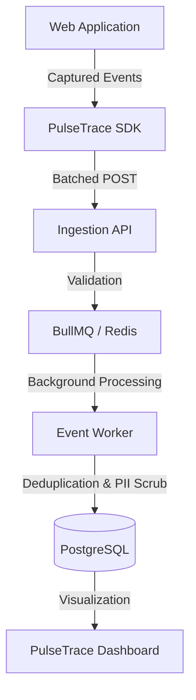

# PulseTrace 🚀

[](https://github.com/KumarDhananjaya/pulsetrace/actions)
[](https://opensource.org/licenses/MIT)

PulseTrace is an open-source, high-performance telemetry and error tracking platform—built to handle millions of events with minimal latency. 

## 🏗️ Architecture



## 📦 Project Structure

- **[sdk/](./sdk)**: The lightweight JavaScript/TypeScript engine for error tracking and performance monitoring.
- **[api/](./api)**: High-throughput ingestion server with background processing.
- **[dashboard/](./dashboard)**: Professional React interface for issue visualization and management.

## 🚀 Quick Start

### 1. Setup Infrastructure
Ensure you have Redis and PostgreSQL running locally or in Docker.

### 2. Install Dependencies
```bash
# In each folder
npm install
```

### 3. Start Development
```bash
# Start API
cd api && npm run dev

# Start Dashboard
cd dashboard && npm run dev
```

## 📜 Documentation
- [SDK Documentation](./sdk/README.md)
- [API Documentation](./api/README.md)
- [Contributing Guide](./CONTRIBUTING.md)

## 🛡️ License
MIT © [Kumar Dhananjaya](https://github.com/KumarDhananjaya)
