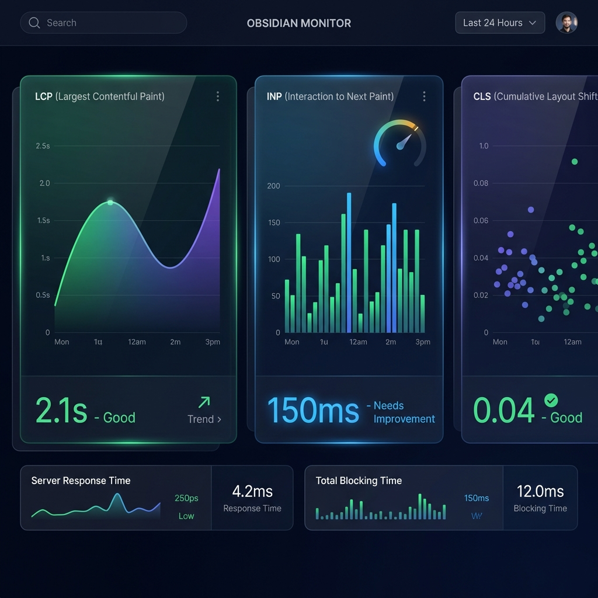
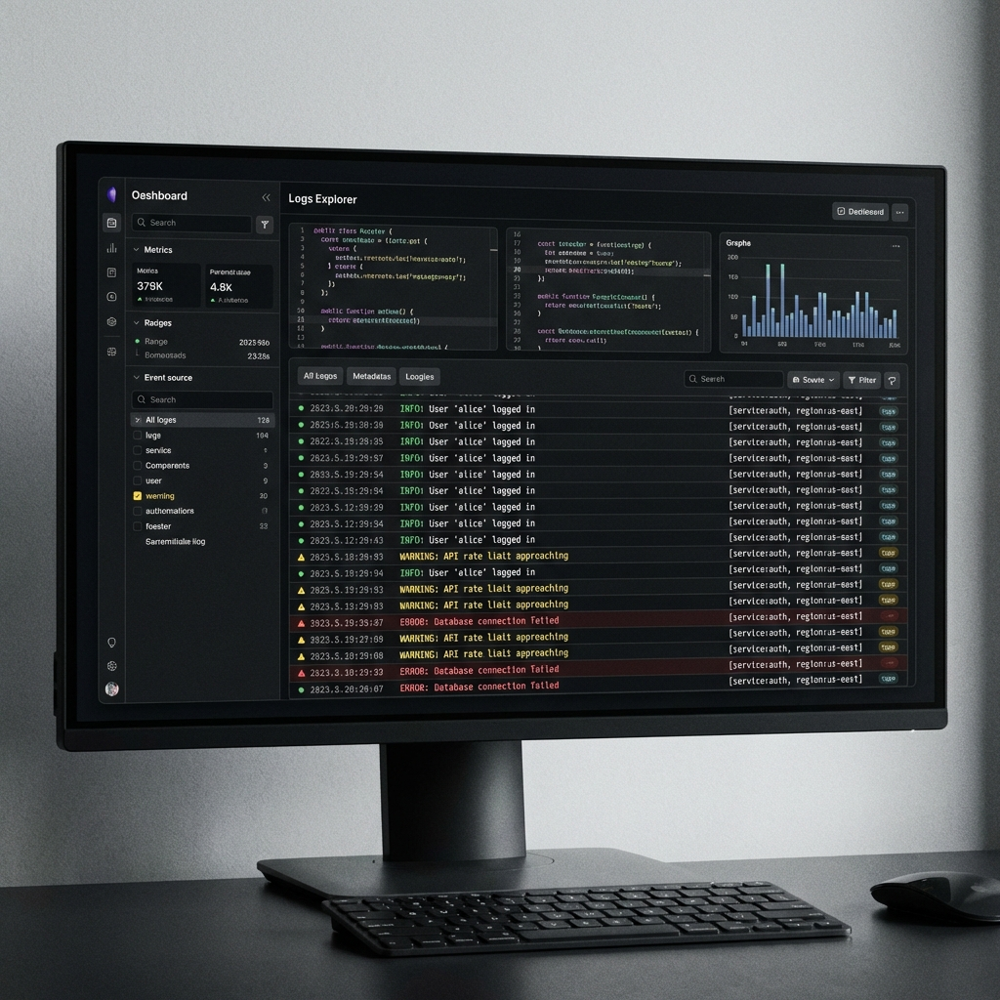
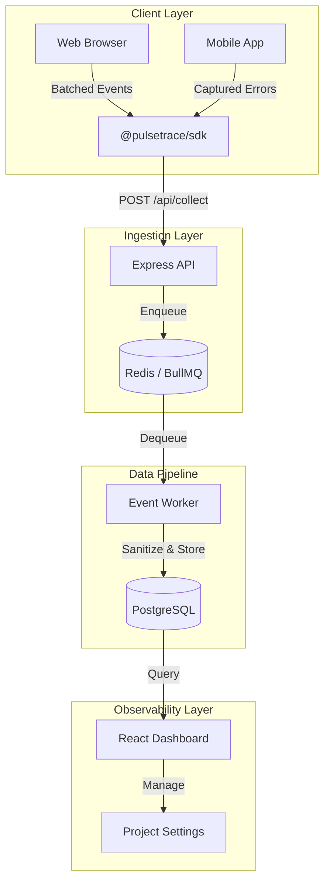

<div align="center">

  <br />

  <h1>PulseTrace 🚀</h1>
  <p><strong>Open-source, enterprise-grade telemetry and error tracking for the modern web.</strong></p>

  [](https://github.com/KumarDhananjaya/pulsetrace/actions)
  [](https://opensource.org/licenses/MIT)
  [](https://vitejs.dev/)
  [](https://expressjs.com/)
  [](https://api.prisma.io/)
  [](https://www.typescriptlang.org/)
  [](https://tailwindcss.com/)
</div>

---

## 🌟 Overview

PulseTrace is a high-performance monitoring platform designed to provide developers with deep insights into application health, performance, and reliability. Built with a focus on developer experience and low-latency data processing, PulseTrace handles everything from real-time event streaming to historical uptime analysis.

### Core Pillars

*   **⚡ Velocity**: High-throughput ingestion powered by Redis and BullMQ sidecar workers.
*   **📊 Insights**: Native support for Core Web Vitals (LCP, INP, CLS) with precision tracking.
*   **🌐 Persistence**: Global uptime monitoring with a 24-hour historical audit trail.
*   **🔍 Clarity**: Structured log explorer with real-time level filtering and metadata inspection.
*   **🛡️ Security**: Enterprise-grade OAuth 2.0 integration and project-scoped sessions.

---

## ✨ Features

### 📊 Real-World Performance
Analyze how real users experience your application. Identify slow interactions, layout shifts, or large paint times across different devices and browsers.



### 🌐 Global Availability
Monitor your endpoints from various checkpoints and visualize uptime trends with interactive status bars.


### 🩺 Real-time Intelligence
Observe your system as it moves. The real-time diagnostics feed and logs explorer provide an instant window into your production environment.



---

## 🏗️ Architecture

PulseTrace uses a robust, decoupled architecture to ensure horizontal scalability.



---

## 🚀 Quick Start

### 1. Requirements

*   **Node.js** (v18+)
*   **Docker** (for Redis and PostgreSQL)
*   **Git**

### 2. Launch Infrastructure

```bash
docker-compose up -d
```

### 3. Install & Build

```bash
# Install root and workspace dependencies
npm install

# Build all packages via Turbo
npm run build
```

### 4. Start Development

```bash
npm run dev
```

The services will be available at:
- **Dashboard**: `http://localhost:5173`
- **API**: `http://localhost:3001`

---

## 📦 SDK Installation

Integrate PulseTrace into your application in under a minute.

```bash
npm install @pulsetrace/sdk
```

```typescript
import { PulseTrace } from '@pulsetrace/sdk';

PulseTrace.init({
  dsn: "https://api.pulsetrace.com/collect?api_key=YOUR_KEY",
  environment: "production",
  release: "1.0.0"
});
```

---

## 🛠️ Tech Stack

*   **Frontend**: React, Vite, Tailwind CSS, Lucide
*   **Backend**: Node.js, Express, TypeScript
*   **Ops**: BullMQ, Redis, PostgreSQL, Prisma
*   **Monorepo**: TurboRepo

---

## 🛡️ License

PulseTrace is [MIT Licensed](./LICENSE).

Built with ❤️ by [Kumar Dhananjaya](https://github.com/KumarDhananjaya)
