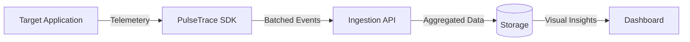

# 01 - High-Level Design (HLD)

PulseTrace is a distributed telemetry system designed to provide real-time visibility into application health through error tracking and performance monitoring.

## 🎯 Objectives
- **Low Impact**: SDK must not interfere with application performance or stability.
- **Scalability**: Ingestion layer must handle bursty traffic without data loss.
- **Actionability**: Group thousands of individual errors into actionable issues.

## 🗺️ Logical Flow

## 👤 User Stories
1. **Developer**: "I want to see the exact line of code where an exception occurred, along with user actions leading up to it."
2. **DevOps**: "I want to monitor Web Vitals to ensure our site performance isn't degrading after a release."
3. **Product Manager**: "I want to see how many users are affected by a specific bug to prioritize fixes."
