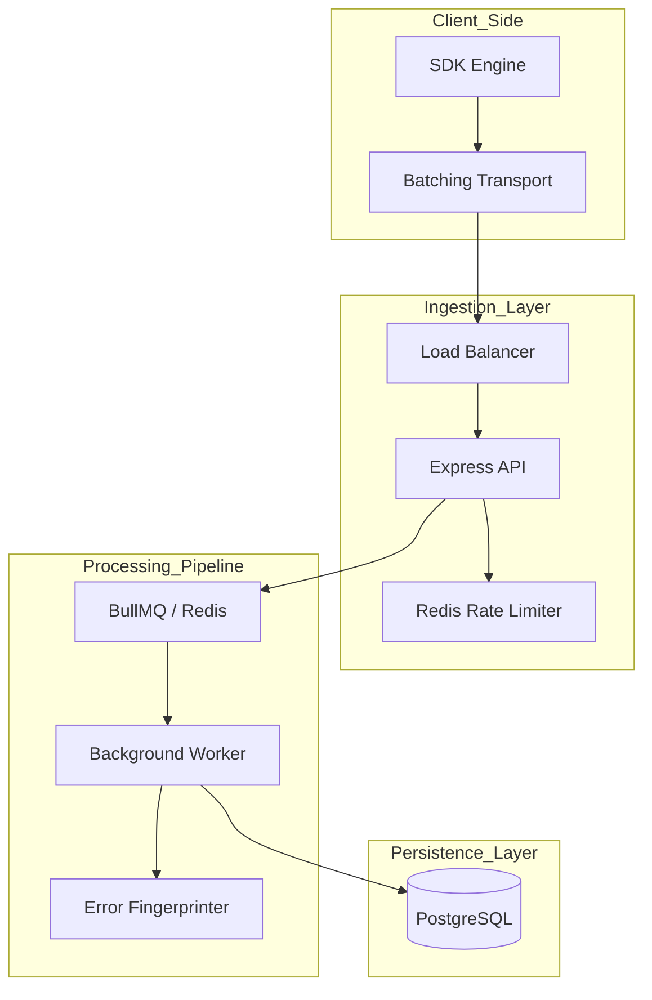

# 02 - Architecture

PulseTrace follows a modern N-tier architecture optimized for write-heavy telemetry workloads.

## 🏗️ System Components

## 🏢 Architectural Layers

### 1. Ingestion Layer (Stateless)
- **Responsibility**: Validate API keys, rate-limit clients, and push events to the queue.
- **Tech**: Node.js, Express, ioredis.

### 2. Processing Layer (Asynchronous)
- **Responsibility**: Offload heavy computations (hashing, PII scrubbing) from the main thread.
- **Tech**: BullMQ, Redis.

### 3. Storage Layer
- **Responsibility**: Persistent storage of deduplicated issues and raw event metadata.
- **Tech**: PostgreSQL, Prisma.
