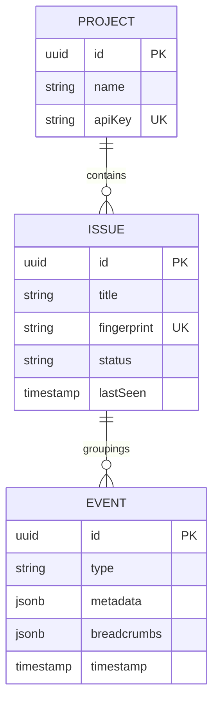

# 03 - Data Model

PulseTrace uses a relational schema designed to balance write speed for events and read performance for aggregated issues.

## 📊 Entity Relationship Diagram

## 🔑 Key Design Decisions

### 1. JSONB for Metadata
We use `jsonb` in PostgreSQL to store variable event data (stack traces, device info, breadcrumbs). This allows us to store arbitrary metadata without constant schema migrations.

### 2. Fingerprinting (Deduplication)
Every `EVENT` belongs to an `ISSUE`. The `fingerprint` is a unique hash derived from the stack trace. This prevents the `ISSUE` table from bloating and allows group-level status management (e.g., "Mute this issue").
