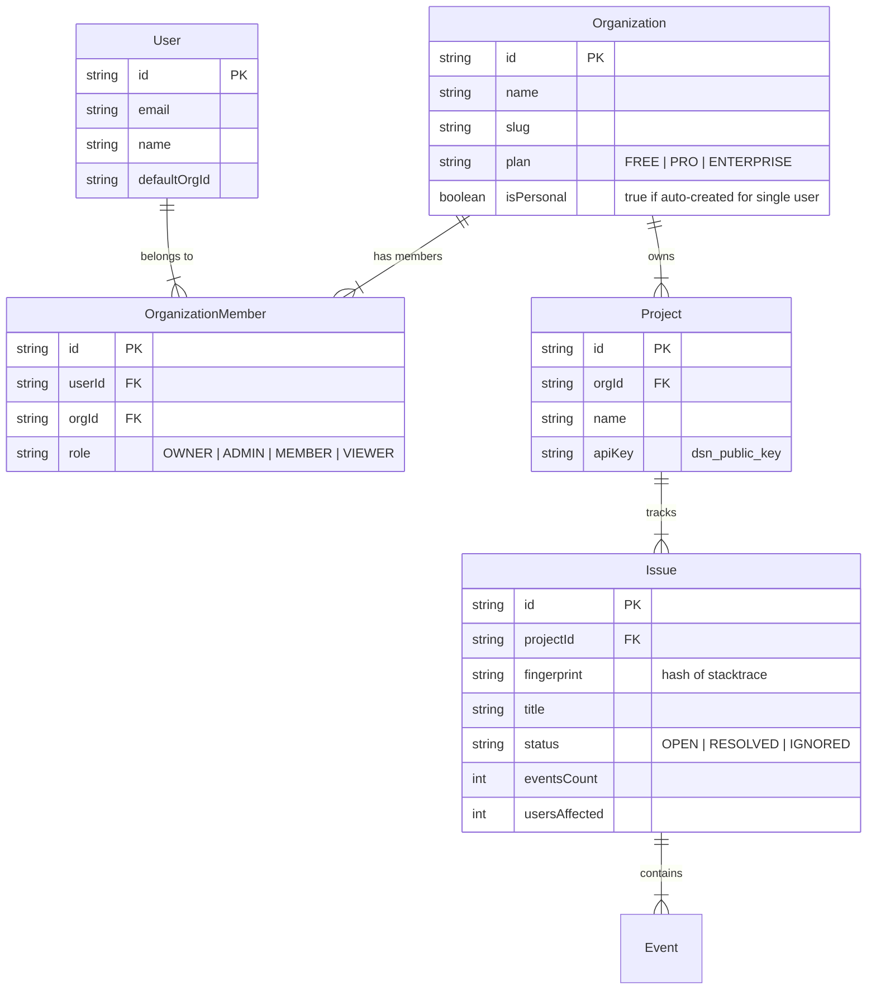

# 03 - Data Model

The database schema is designed to support **Multi-Tenancy** from day one, allowing the product to scale from a single freelancer to a large enterprise.

## 🧠 Core Concept: "Personal Space" vs "Organization"
To satisfy the requirement of "Single User OR Organization", we use a unified model:
1.  **Single User**: Every user automtically gets a "Personal Organization" where they are the only member.
2.  **Organization**: Users can create (or be invited to) shared Organizations.

This means the code **always** deals with an `Organization`, keeping the logic consistent.

---

## 🏗️ Entity Relationship Diagram

## 📝 Schema Definitions

### 1. Identity & Access
- **User**: The human.
- **Organization**: The billing boundary. A freelancer has a Personal Org. A company has a Company Org.
- **OrganizationMember**: The mapping table. Handles RBAC (Roles).

### 2. Telemetry Data
- **Project**: A specific application (e.g., "IOS App", "Marketing Site"). Belongs to ONE Org.
- **Issue**: A group of similar errors (deduplicated).
- **Event**: A single occurrence of an error (Immutable).

## 🚀 "Single User" Flow
1. User signs up.
2. Backend creates `User` record.
3. Backend creates `Organization` (Name: "User's Workspace", isPersonal: true).
4. Backend adds `User` as `OWNER` of that Org.
5. User is redirected to that Org's dashboard.

## 🏢 "Organization" Flow
1. User clicks "Create New Team".
2. Backend creates `Organization` (Name: "Acme Corp", isPersonal: false).
3. Backend adds User as `OWNER`.
4. User invites `colleague@acme.com`.
5. Colleague joins as `MEMBER`.
6. Both can see Projects in "Acme Corp".
