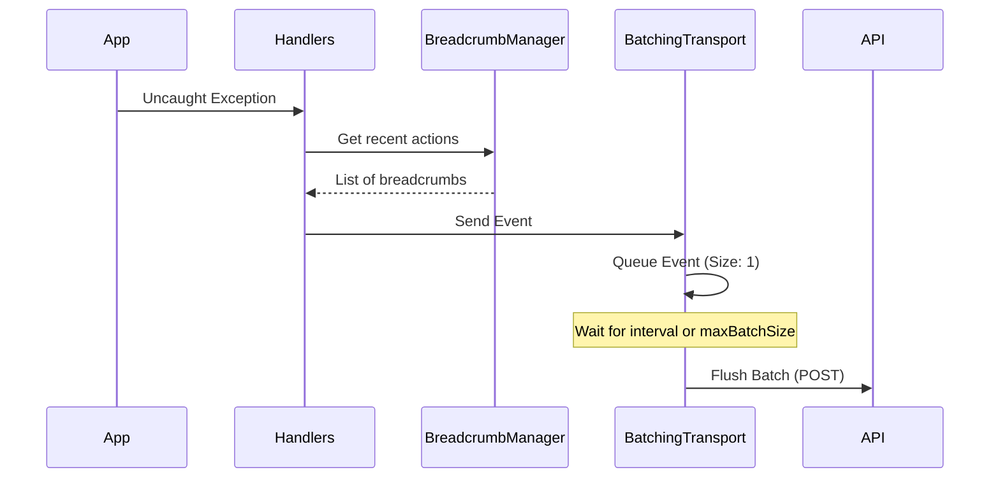

# 04 - SDK Design

The SDK is a zero-dependency (almost) engine designed for reliability and minimal footprint.

## 🔄 Internal Logic Flow

## 🛠️ Design Principles

### 1. Non-Intrusive Instrumentation
We use monkey-patching for `console.error` and `history.pushState` but ensure the original behavior is preserved. The SDK wraps itself in `try/catch` blocks so that SDK failures nunca crash the user's application.

### 2. Circular Breadcrumb Buffer
To prevent memory leaks, breadcrumbs are stored in a circular buffer of fixed size (default: 20). When the buffer is full, the oldest breadcrumb is discarded.

### 3. Transport Fallback
We primarily use `fetch` with `keepalive: true`. If the browser is shutting down, we use `navigator.sendBeacon` to ensure the final batch of events is delivered.
