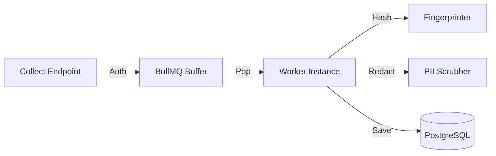

# 05 - Ingestion Pipeline

The Ingestion Pipeline is designed for "Write-Fast, Process-Later" mechanics.

## 🌊 Pipeline Diagram

## 🚀 Throughput Optimization

### 1. Instant Acknowledgement
The API does not wait for database writes. Once an event is validated and pushed to Redis, we return `202 Accepted` to the SDK (usually in < 10ms).

### 2. Backpressure Management
By using BullMQ, we can survive massive traffic spikes. If the database slows down, the Redis queue acts as a buffer until the workers catch up.

### 3. Horizontal Scaling
Because the workers are stateless consumers of the Redis queue, we can scale the `api` and `worker` instances independently based on load.
