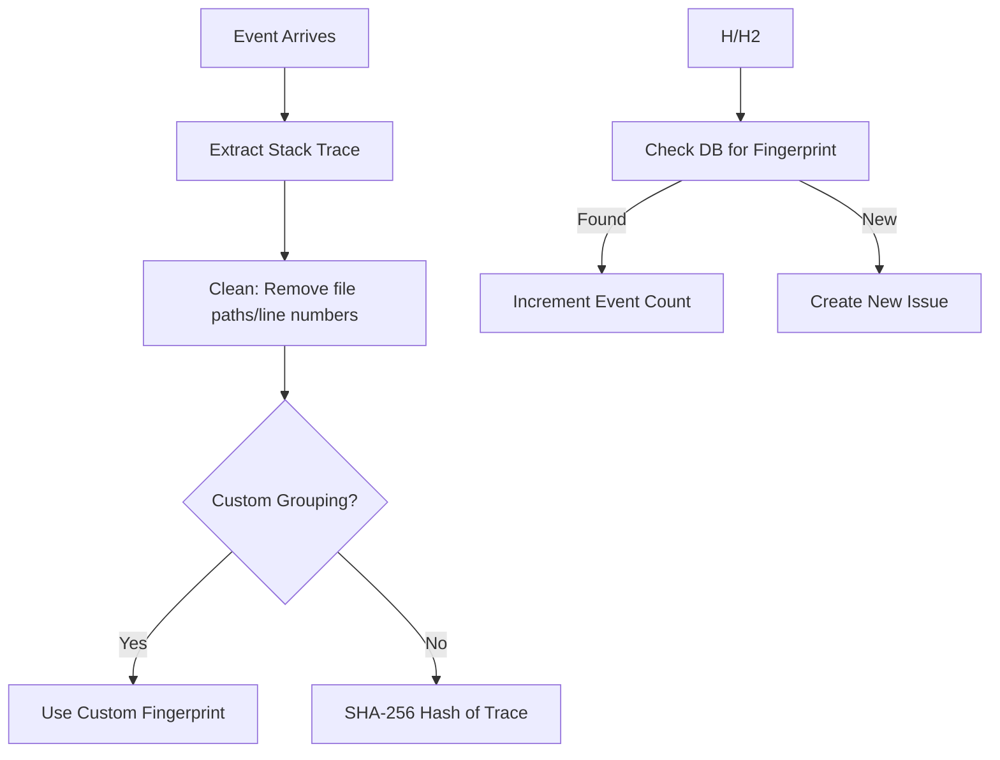

# 06 - Error Fingerprinting

Fingerprinting is the process of grouping unique error events into a single "Issue" to reduce noise.

## 🧬 Algorithm Logic

## 🧹 Trace Normalization
To ensure stability, we normalize stack traces before hashing:
- Remove variable memory addresses.
- Redact user-specific file paths (e.g., `/Users/name/` -> `/src/`).
- Focus on function names and module hierarchy.

By focusing on the *cause* of the error rather than its *location in time*, we provide a clean, aggregated developer experience.
