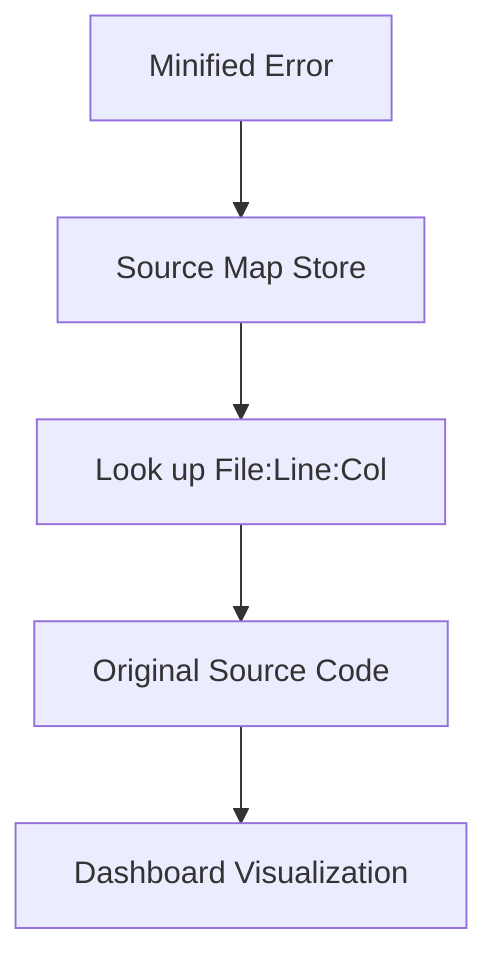

# 07 - Source Maps

Since most modern apps are minified (e.g., by Vite, Webpack), PulseTrace must map obfuscated stack traces back to original source code.

## 🗺️ Mapping Process

## 🛠️ Implementation Strategy

### 1. Artifact Upload
During the build process, developers upload `.map` files to the PulseTrace API.

### 2. Server-Side Resolution
When a minified event arrives, the worker uses `source-map` library to reverse the transformation *before* the developer sees the issue in the dashboard.

### 3. Security
PulseTrace stores these maps securely so that sensitive source code is never exposed to the public-facing SDK clients.
