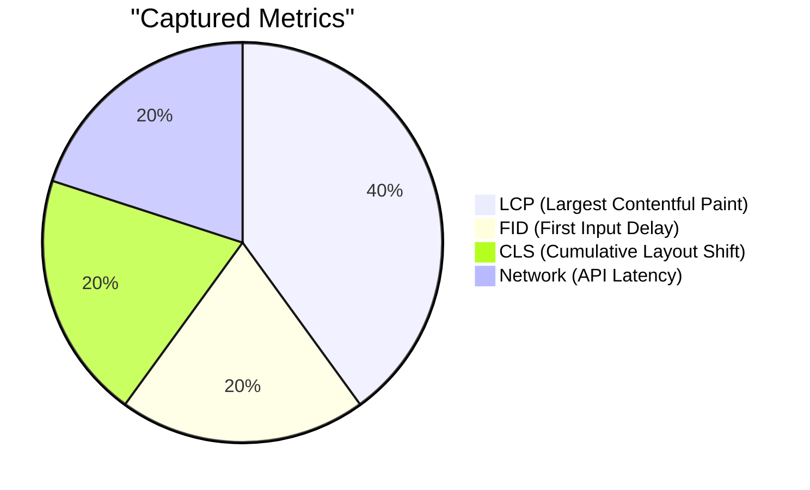

# 08 - Performance Monitoring

PulseTrace goes beyond errors to track real-user metrics (RUM) and performance vitals.

## 📈 Performance Vitals

## 🕵️ Monitoring Methodology

### 1. PerformanceObserver
We use the browser's `PerformanceObserver` API to capture vitals without polling. This ensures zero CPU overhead when nothing is happening.

### 2. Network Instrumentation
By patching `fetch` and `XMLHttpRequest`, we track:
- **Duration**: Total time for API round-trips.
- **Success Rate**: Distribution of HTTP status codes (2xx, 4xx, 5xx).
- **Size**: Payload sizes to identify bloated API responses.

These metrics are aggregated in the dashboard to show performance trends over time.
