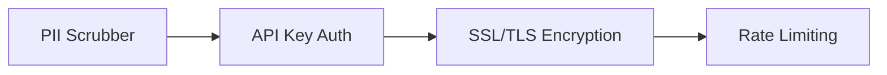

# 09 - Security

PulseTrace implements security at the SDK, Network, and Ingestion layers to protect user data.

## 🛡️ Security Layers

## 🔐 Core Protections

### 1. PII Scrubbing (Privacy)
The worker automatically redacts sensitive patterns:
- Emails: `*@*.*`
- Credit Cards: (Luhn validation check)
- SSNs and Passwords.

### 2. API Key Scoping
Requests are only accepted if they include a valid `x-api-key` associated with a registered project.

### 3. Rate Limiting
To prevent DDoS and SDK abuse, we use Redis-based rate limiting per API key. If an app is spamming errors, we temporarily drop their events to protect the infrastructure.
